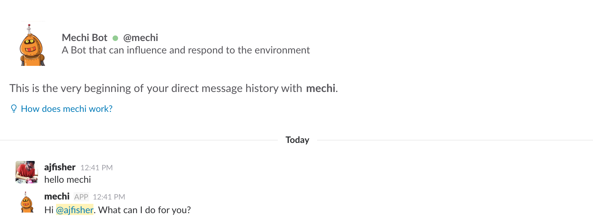

# Hello, Bot

## Objective

In this exercise you will create a simple bot that will connect to your slack
team and allow you to speak to it. This will show you the basic parts of
how the bot will observe conversations and can interact with its humans.

## Preparation

Ensure you have followed all of the main set up actions including installing
npm dependencies and setting up your bot from the main README file.

## Write or open the example file.

The example code is located in `examples/code/2-bot-hello.js` or you can use the
code below:

```
'use strict';

const dotenv = require('dotenv').config(); // 1
const Botkit = require('Botkit');

console.log("Attempting to get the bot online");

let botcontroller = Botkit.slackbot({ // 2
	debug: false,
});

const config = {
	token: process.env.SLACK_TOKEN, //3
};

botcontroller.spawn(config).startRTM((err, bot, payload) => {
    // 4
    if (err) {
        throw new Error(err);
    }

    console.log("Now online");
});

const keywords = ['hello','hi', 'howdy']; // 5
const channels = ['direct_message', 'direct_mention', 'mention']; // 6

botcontroller.hears(keywords, channels, (bot,message) => { // 7

    let user = `<@${message.user}>`;

    bot.reply(message, `Hi ${user}. What can I do for you?`); // 8
});
```

Code notes:

1. `dotenv` is a package which allows you to use a dotfile to manage your
enviroment variables. This helps with deployment and portability.

2. botcontroller is the botkit instance that will control the various parts
or events your bot can see,

3. Grab the slack token from your dotenv generated environment variable.

4. Start the bot instance and try to connect to slack. Throw an error if there's
a problem.

5. These are the specific keywords your bot will listen for. You can also use
regexes here to make things more generic.

6. These are the types of channels your bot can listen to.

7. `Hears` is an event listener that is is registered to listen for the keywords
on the channel types specified and then executes the callback as a result.

8. Reply will respond back in the channel where the human initiated the message
from.

## Run the example

You can run the example by executing the following:

```
node examples/code/2-bot-hello.js
```

Your script should print out some initialisation information similar to below:

```
Attempting to get the bot online
Initializing Botkit v0.5.5
info: ** No persistent storage method specified! Data may be lost when process shuts down.
info: ** Setting up custom handlers for processing Slack messages
info: ** API CALL: https://slack.com/api/rtm.connect
notice: ** BOT ID: mechi ...attempting to connect to RTM!
notice: RTM websocket opened
Now online
```

Once online, you can drop into slack and you should see your bot become available.
At this point try and DM it and say "Hi" or "Hello" and it should reply.



If you want to talk to your bot in a public channel, you'll need to invite it
just like a human and then @target it just like you'd notify a person you're
aiming a message at them. Direct channels don't require this function.

## Extensions

Go further with some of these ideas:

* Try making your bot more responsive by creating an array of responses and then
choosing one randomly to respond with.
* Make your bot respond to a wider set of trigger words.
