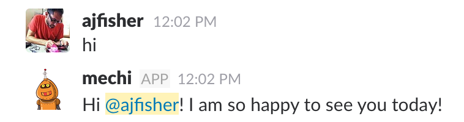

# Bots with an emotional model influenced by the world

## Objective

This exercise takes data from the environment, namely temperature and time
information and it will use this to change its replies back to the human. To
do this it will have a simplified emotional model.

## Preparation

Keep the circuit from the previous exercise as we'll use that to provide the
temperature data into the bot.


## Design considerations

In this scenario our setup looks like this:

* The temperature sensor streams temperature data over MQTT at whatever frequency
makes sense.
* The bot captures this information as it comes in and holds a current view of
the temperature.
* The bot will have an understanding of the current system time. It will just
take the hour off this and use it to get an understanding of what time it is
during the day.
* This data will then be used to update the emotional state. Depending on the
time of day, the bot will be more or less aroused (active or tired) and then
depending on if the temperature is above or below the preferred range, it will
change the bot's pleasure/non-pleasure and dominance axes.

## New environment variables

You will need to configure some additional enviroment variables in your `.env`
file as outlined below:

* `BOT_EMOTION_UPDATE` - changes how frequently the bot samples data to update
it's emotional state. During dev you'll want this quite low but you can make it
longer to represent a more normal behaviour.

## Use the example files

The examples are split up over several files


* `7-temp-server.js` - used to connect the arduino and sample the temperature
data and send it to MQTT server. This is the same as the previous one
* `7-temp-cmd.js` - can be used to issue a temperature value specifically if
you want to push the range more than possible with actual sensor.
* `7-emotion-bot.js` - the bot code that responds to the environment.

### Code notes


1. `lib/emotion.js` is a library that provides the PAD state model and
assigns emotions based on the state position. It uses a string vector to
manage positive, neutral and negative position of the three axes in the state
model.

2. `7-emotion-bot.js:8-18` provides set up for the emotional state of the
bot and looks after the current and preferred temperature ranges.

3. `7-emotion-bot.js:77-100` are handlers for interrogating the state of the
bot via direct messages. You can see here you can ask it for its current state,
current temperature and current emotion to see what its internals look like
via slack.

4. `7-emotion-bot.js:100-135` updates the state of the bot based on a combination
of temperature and time.

5. `7-emotion-bot.js:16-75` provides the hello response and does the look up
of the response based on the emotional state provided by the model.

## Run the example

As before you'll probably want multiple terminals to do this.

Start by running the temperature server

```
node examples/code/7-temp-server.js
```

Alternatively you can also post a message directly if you want to set particular
temperatures. You can do that with the following command:

```
node examples/code/7-temp-cmd.js <value>
```

Where `<value>` is an integer temperature value you want to set eg:

```
node examples/code/7-temp-cmd.js 33
```

Run your bot with the following command

```
node examples/code/7-emotion-bot.js
```

### Interactions from DM

From a direct message you can do the following actions:

* `settime XX` where XX is the hours of the day you want to push your bot to.
By default it uses the current time so probably 10 or 11 but you can force it
to different points in the day to see its effect.
* `current temp` reports the current temperature value it knows about
* `current state` reports the emotional state vector data (caps are postive,
lowercase are negative and `_` is neutral on a given axis)
* `current emotion` renders the internal state to a specific emotion.

### Interactions elsewhere

If you say hello to the bot eg: `Hi @botname` then depending on it's current
emotional state, it will respond to you in different ways.

You should get a reply similar to this:



## Going further

* You can create more interactions and create diversity of responses.
* You could make your bot more or less moody based on it's positivity score,
this is used when a bot is in neutral state and pushes them to one side of the
emotional state cube or the other.
* You can change the stimulus elements to affect mood more or less dramatically
* You could add a positive pleasure value based on numbers of interactions that
maybe drops off over time so it gets bored.
* Whenever the bot updates it's internal state, randomly decide if it's going
to say something publicly in a channel based on it's emotional status. Eg it
might post a gif of something happy or bored or similar. Using a service like
`/giphy happy` would create an interesting effect due to the randomness of the
gif selection.


