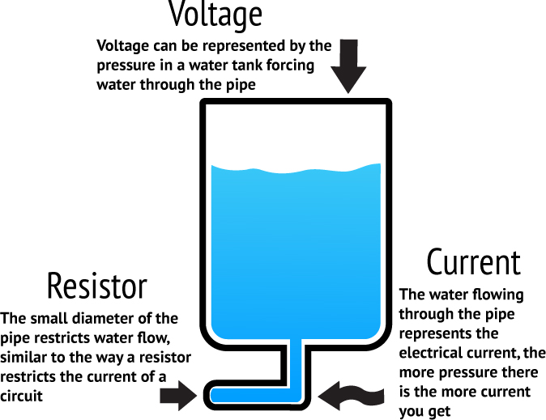

# Building Embodied Bots with JavaScript
<!-- .slide: class="title" -->

DDD Melbourne, 12 August, 2017<!-- .element: class="location" -->

Andrew Fisher @ajfisher<!-- .element: class="author" -->


Notes:

Hi, my name is Andrew Fisher and I'm an interaction developer & researcher and
today I'm going to guide you through the process of building an embodied bot
in javascript for the next 90 minutes.

---

## Bots appearing everywhere
<!-- .slide: data-background-image="/images/droids.jpg" -->

(CC) Flickr <!-- .element: class="attribution" -->
[⣫⣤⣇⣤](http://www.flickr.com/photos/donsolo/3768623542/)

Notes:

As you'll be aware, we are now starting to see bots turn up everywhere. One of
the reasons for this is because Natural Language Processing got considerably
better over the last decade. In addition, the ability to learn at scale using
machine learning techniques allows our bots to get progressively better with time.

And finally but crucially, the maturity of our messaging platforms that are
built on open, well documented and robust APIs are blurring the lines between
what a bot and human can do on those platforms.

---

### A bot for everything
<!-- .slide: data-background-image="/images/slackbots.png" -->

(CC) Flickr <!-- .element: class="attribution" -->
[Slack HQ](https://slackhq.com/the-inevitable-rise-of-the-bots-36d9993e7bf5)


Notes:

All of this means that we're starting to see more and more bots pop up in the
wild in places like Slack and Facebook for all kinds of purposes. Both
pragmatic and whimsical.

---

### Embodied social bots
<!-- .slide: data-background-image="/images/robot_johngreenaway.jpg" -->

(CC) Flickr <!-- .element: class="attribution" -->
[JohnGreenaway](https://www.flickr.com/photos/johngreenaway/3356358479/)

Notes:

One of the areas I'm particularly interested in, given my interest in interaction,
is how virtual bots can influence the physical world and in turn be influenced
by the environment.

---

### Embodiment
<!-- .slide: data-background-image="/images/embodiment_flower.jpg" -->

(CC) Flickr <!-- .element: class="attribution" -->
[Krissy Venosdale](https://www.flickr.com/photos/venosdale/36046843801/)

Notes:

This idea is the premise of embodiment and some people in AI and Pyschology
belive it's critically important in creating higher order, more generalisable
virtual intelligences. I'm an adherent of that view as well.

So today we are going to play around with this idea - you'll all be making
a Slack bot that can reach out and influence the world and also be affected by
the enviroment.

---

## Agenda

1. Embodiment and cognition

2. Hello, Hardware and Hi, Botty

3. Building a bot with emotions

Notes:

To do that, we're going to cover off the following areas.

We'll start with a quick bit of background to lay the foundations.

From there we'll start diving into some hands on, practical examples so you
can make sure you have the basic electronics and slack bots set up.

Finally we'll build out our embodied slackbot.

---

### Workshop repository 

github.com/ajfisher/embodied-bots <!--.element class="bigtext" -->

Notes:

Before we get started there are some tasks you need to have done. This first
part is going to take about 10 minutes, so if you haven't already, hit this repo,
clone it and follow the directions to get the basic set up done. If you don't
do this quickly you'll have to play catch up during the next steps.

We also have some equipment down here which we'll hand out in the next section.

Finally, you do need to have a resonable sense of JS and Node to play along
so if you don't and want to exit, now may be the time if you want to catch
a different session.

---

# Embodiment and cognition

Notes:

With that all out of the way, let's start with some of the basics around what
we're properly talking about.

---

## Embodiment and cognition

* Background to embodiment
* Stack overview
* The PAD emotional state model

Notes:

To do that we'll start with some basic concepts around embodiment, look at the
broad stack we'll be using to do this with and then finally dicussing the
model we'll be using to embody our bots.

---

## Embodiment theories

> Many features of cognition are embodied in that they are deeply dependent upon
> characteristics of the physical body of an agent, such that the agent's
> beyond-the-brain body plays a significant causal role, or a physically
> constitutive role, in that agent's cognitive processing.

RA Wilson and L Foglia, Embodied Cognition in the Stanford Encyclopedia of Philosophy
<!-- .element: class="attribution" -->

Notes:

Fundamentally, embodiment is based on the idea that intelligence or cognition
requires a physical body to help drive it. Crucially it is also drive by context.

In most biological cases this context is created by the effects of environment
on the oraganism and shape it via evolution. Thus, the specific nature of
cognition and higher order intelligences are borne out by the niche into which
they are put.

---

## Evolved capability
<!-- .slide: data-background-image="/images/hawk.jpg" -->

(CC) Flickr <!-- .element: class="attribution" -->
[David Seibold](https://www.flickr.com/photos/stillugly/33720129353/)

Notes:

A good example of this is hunting behaviour in predators which generally show
the ability to anticipate with some accuracy, the behaviour of their prey. As
you'd expect, the better a predator can do this, the more likely it will have
a full belly and pass its genes on to another generation.

Similarly, the prey that can anticipate the threat will likely survive well too.

Thus, both physiological evolution occurs in form and brain but also cognition
devlops too.

---

### Fitness functions

Notes:

In many cases, embodiment can be boiled down as a mechanism by which an external
fitness function can be applied to cognition via evolution.

A good example of this was facebook's AI project that sent the world into a spin.

---

### AI Apocalypse

Notes:

In this scenario, the bots were using english via chat bots and evolved strategies
(ie intelligence or embedded cognition) to negotiate numbers of balls shared
between them.

---

### the the the balls

Notes:

In the end they evolved a short hand that is a bit hard for us to read but was
perfectly fine for them to use. The reason for this is the context (or the
embodiment factors that weren't considered).

The bot can process the small amounts of text nearly instantly and with nearly
perfect, though niaive comprehension.

As an anti-example, it actually shows embodiment really well. The bots can read
the text virtually instantly, without the burdens of vision or aural processing
and read it with high precision. As such there's no practical upper bound on length of
message nor information density and so this weird language evolves.

I say weird and yet we have many examples of human languages that use repetition
to mean more of something so it's not that weird really. The challenge for us
is it becomes hard for us to interpret.

---

### Not fit for purpose

Notes:

The reason fb shut this project down was that it didn't meet its goal which was
to build a bot that could interact with humans as a help bot.

Thus, we get insight about human scale reading speed and comprehension as being
potentially important factors in designing a bot that can negotiate with an
actual human.

---

## System blocks

Notes:

Now you understand embodiment a bit more and see where we're going. Let's
consider the basis of how we build this thing. Let's walk through the key
pieces.

---

### Sensorimotor

Notes:

First we have th microcontroller part which will provide the sensorimotor
interface to the world. This will be an arduino running a C-firmware called
firmata and it will talk over USB to NodeJS via using the Johnny-Five NodeBots
framework.

---

### Language interface

Notes:

The human / bot interaction will happen using slack and will use the BotKit
library to help manage the conversations and abstract the slack API to make
the bot more conversationally oriented. This will mediate the conversation
between the bot and the human.

---

### Embodied Cognition application

Notes:

Finally, up the top here is where we'll spend most of our time. This application
will be running a model tat creates and responds to language and build the
bot's internal state that represents the world. Besides a basic state model,
we'll also be building a simple emotional model based on Mehrabian & Russell's
PAD emotional state model which is a bit dated but gives us a good approximation

---

### PAD emotional state model

Notes:

We'll get stuck into those first two parts in the practical section, but before
we do that let's get the theory of what we'll build out of the way while you're
all paying attention.

The PAD model is a bit dated, it was designed in the 70s & 80s but still has
descriptive value. It has been replaced in many ways by more biologically
based models. The benefit though is that it's quite simple to model and for
caricature style emotional states it works well enough for our purposes.
If this is of interest, then check
out Lövheim's cube of emotion for more up to date models using neurotransmitter
effects.

In the model, there are three orthogonal axes, Pleasure / Displeasure, Arousal /
Non-Arousal and Dominance-Submissive scales.

As these combine together you get a reasonable range of emotions. For example
fear and anger are both unpleasant emotions that both register high on arousal
however anger is a highly dominant emotion whereas fear is a submissive one.

As I mentioned this is a simple model, but it's one we can implement algorithmically
as all we need is a vector that points towards one of the 8 corners of the cube.

We'll use some external stimuli to affect the position of the bot on these scales
and this should generate different responses back to the human.

---

## Embodied bots in practice

Notes:

So what we'll end up building will be a very simple iterpretation of emotional
state in our bot and I'm not suggesting this should be used for all your
conversational UIs. However, it does create an interesting experiment that
is worth playing with as you explore this space.

---

# Hello, Hardware /<br/>Hi, Botty

Notes:

Now you understand the background to embodiment and the three parts of the
system we're going to build, let's get the basics out of the way and evolve
our bot towards embodiment.

---

## Hello, Hardware / Hi, Botty

* Blink an LED
* Talk to a bot
* Get bots to do your bidding

Notes:

Now we're going to get the foundations sorted out so we can get a basic
electronic circuit up and running and interacting from node. Then we'll talk
to a simple slack bot and finally we'll merge the two together.

I have some kits down here at the front. They are in boxes and some little bags.
You'll probably want to work in some small 2-3 person groups as there won't be
enough for everyone. It's also worth pointing out that if you want to take some
parts home with you to keep playing then I have little kits sort of like the blue
boxes for $20. Just grab me at some point and we can sort it out (I can also
take cards).

So one person from each group come grab a kit and we'll get cracking.

---

### Get started

github.com/ajfisher/embodied-bots <!--.element class="bigtext" -->

Notes:

Another pointer to the repo if you need it. Last chance. If you haven't grabbed
it by now then you may want to jump in with a group.

---

## Electronics intro
<!-- .slide: data-background="/images/electronics.jpg" -->

(CC) <!-- .element: class="attribution" -->
[ajfisher](http://twitter.com/ajfisher)

Notes:

Okay so let's get cracking. We'll start with some basic electronics. Enough to
get you by. Who here as done any electronics recently?

A handful okay, so we'll quickly touch on the simple bits you need to know for
today and where to find out more.

---

## Voltage, Current, Resistance



(C) <!-- .element: class="attribution" -->
[Tinkernow](http://http://tinkernow.com/)

Notes:

The easiest way to think about electronics is like water and pipes. The wires
are pipes, the electrons or electricity is like water going through the pipes.

Voltage then is like the pressure. So if you imagine I have a big tank or I turn
on a mains tap there's a lot of pressure. So that's like having a powerful battery
or plugging in the powerpoint. This is measured in volts. All the stuff we'll
use today is 5V which you can run from USB on your computer so won't kill you or
really probably blow anything up.

Current is the rate of flow of the electricity through the circuit. This is measured
in Amps. If you have a big motor attached to the circuit you can imagine it would
need more energy to turn it than a little LED. As such we say it draws a lot of
current - thus makes a lot of flow of electricity.

Finally we have resistance. Think of this like the width of the pipe. If it's
narrow maybe you can't draw much electricity through it but if it's fat then
you can draw a lot. Some components may draw too much current so you use a
resistor to restrict the flow.

---

### Breadboard
<!-- .slide: data-background="/images/breadboard.jpg" -->

(CC) <!-- .element: class="attribution" -->
[ajfisher](http://twitter.com/ajfisher)

Notes:

So when you are prototyping it's a real drag to solder all the time. As such we
use one of these, it's called a breadboard and it allows you to plug wires into
it and make connections. It's not as secure as soldering but good enough and
allows you to make mistakes.

---

### Ex 1: Hello, Hardware
<!-- .slide: data-background="/images/hello_world.jpg" -->

(CC) Flickr <!-- .element: class="attribution" -->
[Daniel Novta](http://www.flickr.com/photos/vanf/5210360116)

Notes:

Hardware often doesn't have a screen so hello world is blinking an LED.

All of the examples are in the code repo in the examples folder and you can
open the markdown file to follow along. All the code is in the code folder in
examples.

---

### Ex 1: Circuit

<!-- .element width="45%" style="border: none !important;" -->


Notes:

An LED needs a resistor or it draws too much current and it will get destroyed.
Luckily we have that on pin 13. Any other pin and you'll need one but pin 13
is special and it is there already as there's an onboard LED on your
arduino marked by L.

---

### Install firmata

interchange install --interactive <!--.element class="bigtext" -->

Notes:

Now we need to make sure the arduino has firmata on it. You can do this
with interchange which you should have installed globally as part of set up.

Select StandardFirmata and then follow the prompts.

---

### Ex 1: Code

```
const dotenv = require('dotenv').config(); // 1
const five = require('johnny-five');

let board = new five.Board({port: process.argv[2]});

board.on('ready', () => {

    let led = new five.Led(process.env.LED_PIN);
    led.blink(1000);
});

```

Notes:

Do walk through

---

## Ex 2: Hi, Botty

Notes:

Next we'll get the slackbot working. You should have all configured your bot in
slack by now per the readme so you have the token available to go. If not, the
step by step is there.

---

### Ex 2: Hi, Botty - code


```
'use strict';

const dotenv = require('dotenv').config(); // 1
const Botkit = require('Botkit');

console.log("Attempting to get the bot online");

let botcontroller = Botkit.slackbot({ // 2
	debug: false,
});

const config = {
	token: process.env.SLACK_TOKEN, //3
};

botcontroller.spawn(config).startRTM((err, bot, payload) => {
    // 4
    if (err) {
        throw new Error(err);
    }

    console.log("Now online");
});

const keywords = ['hello','hi', 'howdy']; // 5
const channels = ['direct_message', 'direct_mention', 'mention']; // 6

botcontroller.hears(keywords, channels, (bot,message) => { // 7

    let user = `<@${message.user}>`;

    bot.reply(message, `Hi ${user}. What can I do for you?`); // 8
});
```

Notes:

The key parts here is that we set up the controller to talk to slack. It can
talk to other things but we'll use slack as it's great.

We're then going to listen for particular keywords. These can be regexes but
in our case this is going to be very simple direct text.

Next we consider the channels we want to listen to. In our case we'll listen
to direct message which is any discussion bewteen me and the bot in our 1:1
channel, a direct mention which is where I mention the bot in ANOTHER private
channel and then mention is on a public channel when I've invited the bot to it
and then at it.

We then set up a listener, literally in this case as it's for the bot to hear
those keywords in a channel and then handle it.

In our case we then send a reply back to the user quite simply.

---

### Ex 2: Hi Botty in action

-- Show gif reply.

Notes:

And here you can see it in action.

---

## Ex 3: LightBot, I command you

Notes:

The next example is going to join these two things together now. This is about
the most basic bot we can make that has physical presence however it's basically
a conversational UI that turns your light on and off. This is a good test to
ensure everything is pulled together properly.

You can keep your light circuit from before.

---

### Ex 3: LightBot code

```
'use strict';

const Botkit = require('Botkit');
const dotenv = require('dotenv').config();
const five = require('johnny-five');

let led; // 1

let board = new five.Board({
    repl: false,
});

board.on("ready", function() {
    led = new five.Led(process.env.LED_PIN);
});

var botcontroller = Botkit.slackbot({
	debug: process.env.APP_DEBUG || false,
});

const config = {
	token: process.env.SLACK_TOKEN
};

botcontroller.spawn(config).startRTM((err, bot, payload) => {
    if (err) {
        throw new Error(err);
    }

    console.log("Now online");
});

const channels = ['direct_message', 'direct_mention', 'mention'];

botcontroller.hears(['hello', 'hi',], channels, (bot,message) => {
    let user = `<@${message.user}>`;
    bot.reply(message, `Hi there, ${user}. What can I do for you?`);

});

botcontroller.hears(['lights on',], channels, (bot, message) => { // 2
    led.on();
    bot.reply(message, `<@${message.user}> - there you go`);
});

botcontroller.hears(['lights off',], channels, (bot, message) => { // 3
    led.off();
    bot.reply(message, `<@${message.user}> - there you go`);
});
```

Notes:

As you can see this is just a merge of the two pieces of code however in hears
we now look for the words lights on and lights off. When that happens, we
update the LED and then reply saying there you go. Very very simple.

---

### Ex 3: LightBot demo

Notes:

And here you can see it.

Now we have the basics of a bot that can take specific orders to affect the
world. Not particularly exciting life for the bot but it does give us a
conversational UI to a specific action. You can think of this as alexa order
me chocolate or similar types of behaviour.

---

# Building a bot with emotions

Notes:

Now we've got the absolute fundamentals in place, hardware we can talk to and
a bot we can interact with. Now we want to start building out the rest of our
design.

---

## Building a bot with emotions

* Clarifying ambiguity
* Distributed embodiment
* Using data to influence emotion

Notes:

To do that we'll start by getting the language side sorted a bit better as our
bot is a little too literal. From there we'll look at updating our service
design a bit for scale and finally we get some data and influence the emotions.

---

## Ex 4: Clarifying ambiguity
<!-- .slide: data-background-image="/images/ambiguity.jpg" -->

(CC) Flickr <!-- .element: class="attribution" -->
[baralbion](https://www.flickr.com/photos/baralbion/123863714/)

Notes:

As you can appreciate our bot is a bit one dimensional. It requires very specific
instructions to do things. In bot linguistics what we're trying to do is establish
entities and intents.

---

### Ex 4: Clarifying ambiguity

Turn the lights on

Turn the light on

Switch off the light

Notes:

Entities are things that we can take action on and the intent is the action.

In our original cases we would catch the first item because we're looking for
lights on - the entity being lights and the intent being on. The rest is just
padding.

If you do the second one though it's not specific enough. So we need to use
some regexes to capture this.

Finally the intent and entity are reversed here which we do all the time as
humans.

---

### Ex 4: Clarifying ambiguity - code

```
botcontroller.hears(['light(.?) on', 'on(.?) the light(.?)'], channels, (bot, message) => {
```

Notes:

This is the code we use to help deal with this. You can see we loosen up the
constraints a little to generalise it.

---

### Ex 4: Clarifying requests

```
botcontroller.hears(['light(.?)$'], channels, (bot, message) => {
    bot.startConversation(message, function(err, convo) { // 6

        // first we look at what state the LED is in.
        let state = ledstate ? "on" : "off"; // what is LED currently
        let question_state = ledstate ? "off" : "on"; // what do we ask about

        // add a timeout option
        convo.setTimeout(15000); // 7
        convo.onTimeout((convo) => {
            convo.say(`I'll leave the light ${state}. Just let me know if you want to change it`);
            convo.next();
        });

        // now ask what to do
        // 8
        convo.ask(`The light is currently *${state}*. Do you want me to turn it ${question_state}?`,
        [{
            pattern: bot.utterances.yes, // 9
            callback: function(response, convo) {
                if (ledstate) {
                    led.off();
                } else {
                    led.on();
                }
                ledstate = !ledstate;
                convo.say(`Okay, the light is now ${question_state}.`);
                convo.next();
            }
        },{
            pattern: bot.utterances.no,
            default: true,
            callback: function(response, convo) {
                convo.say('Cool. I\'ll leave it as it is');
                convo.next();
            }
        }] );
    });
});
```


Notes:

Sometimes humans will say things that are super context oriented. For example
one human talking to another in a dark room will say things like "hit the lights"
or "lights please". These make sense to the other person because they are both
navigating a dark room.

Similarly, if you're a parent, how often do you shout "lights!" at a child who
forgets to turn them off when they leave a room.

In this scenario, the bot can cut through the ambiguity in two ways. First
it can ask for clarification as this does. Specifically the way to do this is
to close the options - thus, indicating the current state "the light is off"
and suggesting an intent that must be agreed or disagreed to "would you like
me to turn it on?"

Here we use a conversation thread to navigate these exchanges.

An alternative is to monitor the state of the environment and then use this context
to determine a result. You have to be pretty confident with that approach though.

---

### Ex 4: Clarifying demo

Notes:

Here you can see how the bot clarifies my response before taking an action.

---

## Distributing embodiment

Notes:

In a lot of cases your sensors or actuators will be in the environment and not
directly attached to the computer you're running your bot on. As such we
need a method of communication.

---

### Introducing MQTT

Notes:

MQTT is a protocol that allows telemetry data to be passed around using a pub/sub
model and is a relatively lightweight protocol over TCP.

At it's heart is a topic - which if you use websockets is like a channel
and then you either publish TO a topic or subscribe to get messages FROM
a topic.

It's a really useful protocol that is very descriptive as you can have
heirarchy much like a URL structure to define resources or structure.

---

### Ex 5: Refactoring to distributed lightbot

unique_root_topic/light/ic

unique_root_topic/light/oc

Notes:

In our case we're going to have a service that runs the lights. It will
subscribe to this topic on the public mosquitto server - just note anything you
send here will be public so nothing sensitive.

I use IC for input content and oc for output content. Thus if I want to change
the state I send on or off to IC but when that state has changed I send the
current status to OC.

---

### Ex 5: Light server

```
const dotenv = require('dotenv').config();
const five = require('johnny-five');
const mqtt = require('mqtt');

let led, led_state;

let board = new five.Board({repl: false,});

let client  = mqtt.connect(process.env.MQTT_SERVER)
const sub_topic = process.env.UNIQ_TOPIC + "/light/ic";
const pub_topic = process.env.UNIQ_TOPIC + "/light/oc";

client.on('connect', () => {
    console.log("MQTT Server connected");
    client.subscribe(sub_topic);
});

board.on("ready", () => {
    led = new five.Led(process.env.LED_PIN);
});

client.on('message', (topic, message) => {

    // message is Buffer
    console.log(topic, message.toString());
    let state = message.toString();

    if (state == "on") {
        led.on()
    } else if (state == "off") {
        led.off();
    }

    // publish current state to the output content topic
    client.publish(pub_topic, state);
});

```

Notes:

The light server code is very simple, it interprets a message and then sets the
state accordingly. Here I'm using the separate channels so I don't build an
echo chamber.

---

### Ex 5: Light bot

Notes:

In the light bot I now publish messages to the IC topic whenever someone sends a
message asking for the lights to be changed. This is really the only change
from before - instead of direct access, the access becomes distributed via the
MQTT interface.

There's a command line interface you can use to test that the messages
are sending properly as well.

---

## Using data to influence emotion

Notes:

Now we're getting to the real part of our embodied application. Right now
we have a bot who can influence the real world in a distributed way. Next we
need to allow it to sense the world.

---

## Ex 6: Sensing temperature

Notes:

We'll build on our previous example and build a simple temperature circuit
which can supply data every 10 seconds to the bot. The bot will then provide
that when asked for it.

---

### Ex 6: Circuit

Notes:

Here's the circuit. In this case we're using a voltage divider to directly
sense the values from the arduino and push them into the analog pin.

---

### Ex 6: Temperature Code

```
const dotenv = require('dotenv').config();
const five = require('johnny-five');
const mqtt = require('mqtt');

let temp_sensor;

let board = new five.Board({repl: false,});

let client  = mqtt.connect(process.env.MQTT_SERVER);
const pub_topic = process.env.UNIQ_TOPIC + "/temperature/ic";
const meta_topic = process.env.UNIQ_TOPIC + "/temperature/m";

client.on('connect', () => {
    console.log("MQTT Server connected");
});

board.on("ready", () => {
    temp_sensor = new five.Thermometer({
        controller: 'LM335',
        pin: process.env.TEMP_PIN || "A0",
        freq: process.env.TEMP_FREQUENCY * 1000 || 10000,
    });

    temp_sensor.on("data", (data) => {

        const msg = {
            c: data.celsius,
            ts: Date.now(),
        };

        // use the retain flag to ensure the last value stays behind. This
        // will ensure the bot can always get a value on start up
        client.publish(pub_topic, JSON.stringify(msg), {retain: true});
        //console.log(msg);
    });
});

```

Notes:

In this case, the temperature server code is pretty simple. Every 10 seconds
grab the data off the temperature sensor and send it to the MQTT server.

We use retain here to ensure that a copy is always kept on the server for the
bot.

---

### Ex 6: Bot code

examples/code/6-temp-bot.js

Notes:

The bot code is long but relatively basic so I won't walk through it all here
on screen.

Notably, it is setting up some state, subscribing to the MQTT topic and every
10 seconds it's grapbbing it and putting it into an array. It nabs the data
and compares it all and keeps track of current, max and min.

In a usual application, you'd do this with a database but we're doing it in
memory for simplicty.


---

### Ex 6: Demo

PIC

Notes:

When the human asks for the temperature, the bot replies with a message attachment
to be extra helpful and shows an image, the current and min max etc. This
shows how bots can create rich messages as well as simply replies.

So now we have a bot that can get information about its enviroment, now we can
wrap all of this up into our little example that affects the way a bot talks
to someone based on it's emotion.

---

### Ex 7: Emotional responses

Notes:

As I mentioned, we're going to implement the PAD emotional state mode simply
by using the three axes to drive the emotion to one of the three corners.

Going back to our earliest example, we'll use this to affect how the bot greets
the human...

In our model we'll use two external stimuli, time of day and temperature.

Time of day will be mapped to the Arousal dimension and will be positive through
the early and middle part of the day and then it will go low and negative into
the night. This is a crude approximation of your daily rhythm.

We'll then map the temperature values. If the temperature is inside a normal
range, say 18-24 degrees which is good office temperature then we'll say that
pleasure is high, and outside of that it will go low.

For the moment we'll leave dominance as high but you could map this based on
some other criteria as well. Maybe when the temp range goes really hot it could
push dominance up.

---

### Ex 7: Emotional model code

Notes:

So here you can see we just take the data and we use that to push the bot's
state to one of the 8 corners of the domain.

---

### Ex 7: Response code

Notes:

Now when the bot 

---

### Ex 7: Demo

PIC

Notes:

As you can see here, if I change the temperature, I can push the bot to becoming
more irritable as a result. This will then affect the response it gives me
when I say hello.

---

# Summary

Notes:

And there we have it, you've all created a bot that can manipulate the world
as well as have it's emotions influenced by the environment just like we do. So
you can go home tonight and say that today you built an embodied virtual
intelligence which sounds pretty cool.

---

## Resources

* hackmelbourne.org
* NodeBots Night (1st Weds / month - meetup.com)
* johnny-five.io
* api.slack.com


Notes:

If you're into this sort of stuff then I have some resources here. If you want
to play with this more, then I'd encourage you to come to Hack Melbourne over
in Hawthorn as there's a group of us playing around with AI, autonomous vehicles
nodebots and social robotics. Tuesday and Wednesday is when most of the action
happens.

Finally, I do have some kits available so if you want to keep hacking then
there's little kits you can use to do all of this workshop for $20.

---

# Building Embodied Bots with JavaScript
<!-- .slide: class="title" -->

DDD Melbourne, 12 August, 2017<!-- .element: class="location" -->

Andrew Fisher @ajfisher<!-- .element: class="author" -->


Notes:

If you can bring your parts up after boxing them back up we can clean up ready
for the next session to follow in behind us.

---


## Where are the droids?
<!-- .slide: data-background="/images/droids.jpg" -->

(CC) Flickr <!-- .element: class="attribution" -->
[⣫⣤⣇⣤](http://www.flickr.com/photos/donsolo/3768623542/)

Notes:

Now, for those that might know a bit about nodebots or have been to a nodebots session before, whilst we're
using the nodebots stack (and I'll get into that in a moment), we won't be 
building full scale robots today due to not much time. As such I felt that given
there's some other topics at DDD around things like APIs, Microservices and IoT that this
would be a great opportunity to show you that not only can you build robots
with JS, but you can build IoT devices too and build them quickly and easily.

So if you were here for the robotics and you're a bit disappointed we're not
making battle bots this morning you've still got some time to go check out Troy's
security workshop or learn about APIs.

---

## Electronics intro
<!-- .slide: data-background="/images/electronics.jpg" -->

(CC) <!-- .element: class="attribution" -->
[ajfisher](http://twitter.com/ajfisher)

Notes:

Okay so let's get cracking. We'll start with some basic electronics. Enough to
get you by. Who here as done any electronics recently?

A handful okay, so we'll quickly touch on the simple bits you need to know for
today and where to find out more.

---

## Voltage, Current, Resistance


(C) <!-- .element: class="attribution" -->
[Tinkernow](http://http://tinkernow.com/)


Notes:

The easiest way to think about electronics is like water and pipes. The wires
are pipes, the electrons or electricity is like water going through the pipes.

Voltage then is like the pressure. So if you imagine I have a big tank or I turn
on a mains tap there's a lot of pressure. So that's like having a powerful battery
or plugging in the powerpoint. This is measured in volts. All the stuff we'll 
use today is 5V which you can run from USB on your computer so won't kill you or
really probably blow anything up.

Current is the rate of flow of the electricity through the circuit. This is measured
in Amps. If you have a big motor attached to the circuit you can imagine it would
need more energy to turn it than a little LED. As such we say it draws a lot of
current - thus makes a lot of flow of electricity.

Finally we have resistance. Think of this like the width of the pipe. If it's
narrow maybe you can't draw much electricity through it but if it's fat then 
you can draw a lot. Some components may draw too much current so you use a
resistor to restrict the flow.

---

### Microcontrollers
<!-- .slide: data-background="/images/arduino_nano.jpg" -->

(CC) <!-- .element: class="attribution" -->
[Phil Farugia](#)

Notes:

Okay - that's great, that's how electronics works in a circuit how do we affect it?

So we typically use a microcontroller. A microcontroller is like a really old computer
which you program in C and you can interact very directly with the circuit 
you wire up to it. Today, the micro we'll use is called an Arduino which is
open source hardware and very inexpensive. You can program it in C but you can
interact with it in JS and we'll come to that in a moment.

---

### Breadboard
<!-- .slide: data-background="/images/breadboard.jpg" -->

(CC) <!-- .element: class="attribution" -->
[ajfisher](http://twitter.com/ajfisher)

Notes:

So when you are prototyping it's a real drag to solder all the time. As such we
use one of these, it's called a breadboard and it allows you to plug wires into
it and make connections. It's not as secure as soldering but good enough and
allows you to make mistakes.

---

### Sensors and actuators (LEDs)
<!-- .slide: data-background="/images/leds.jpg" -->

(CC) <!-- .element: class="attribution" -->
[ajfisher](http://twitter.com/ajfisher)

Notes:

Now a microcontroller is just a tiny little computer, you need to plug things
into it to do meaningful stuff. So the things we'll be playing around with 
today are things like this. LEDs emit light. They come in different colours and
one of them is even an RGB one which we'll use in the example.

Note that LEDs are polar so the long leg is the anode or the positive side.

---
## Sensors and actuators (Motors)
<!-- .slide: data-background="/images/servo.jpg" -->

(CC) <!-- .element: class="attribution" -->
[ajfisher](http://twitter.com/ajfisher)


Notes:

Next up we have motors, and specifically servos which are used to move things 
normally thorugh 180° using a digital signal.

---

## Sensors and actuators (Temp)
<!-- .slide: data-background="/images/temp.jpg" -->

(CC) <!-- .element: class="attribution" -->
[ajfisher](http://twitter.com/ajfisher)


Notes:

We'll be using a temperature sensor like this to record the temperature here
in the space and use it. These are very useful as they are inexpensive and 
remarkably accurate.


---

## Sensors and actuators (Light)
<!-- .slide: data-background="/images/light.jpg" -->

(CC) <!-- .element: class="attribution" -->
[ajfisher](http://twitter.com/ajfisher)

Notes:

And finally we have a light sensor which we'll use to measure light intensity.

---

## Resources

* Arduino Experimenters Kit (ARDX)
* Make: Electronics (C. Platt)
* Wikipedia (every component)

Notes:

There are a few resources you can go to to learn more about the basic electronics
but if you're interested, the Arduino Experimenters kit is a great place to start
as is the Make electronics book by Platt. Also Wikipedia has a frightening amount
of info on every component ever made. 

---

### JS ❤ Robotics
<!-- .slide: data-background="/images/robot_love.jpg" -->

(CC) Flickr <!-- .element: class="attribution" -->
[hiperbolica](https://www.flickr.com/photos/hiperbolica/3414999010)

Notes:

Okay so we're all software peeps so that's enough hardware to get you going. So
how do we get JS working with this microcontroller that I said a moment ago
can only use C.

---

## The NodeBots stack


Notes:

There are a few different projects that can use JavaScript on hardware now,
however the one we're going to talk about is called nodebots as it's very much
aimed at a NodeJS implementation with hardware. At the core of nodebots are
transport layers to deal with things like talking over USB or wireless or serial
connections and then wrapped around that is a framework called Johnny Five.

---

## Johnny Five
<!-- .slide: data-background="/images/rick.jpg" -->

(C)<!-- .element: class="attribution" -->
[Joanne Daudier](https://twitter.com/jdaudier)

Notes:

Johnny Five was started by this guy - Rick Waldron, and there are now about
30 core project members, nearly 100 contributors and over 2000
commits to the codebase in the last couple of years. It's a very active and
expanding project and we're always looking for more contributors to help out.

Johnny Five is a hardware abstraction framework so instead of writing code that
is specific to a chip you can talk about components that behave in different
ways and leave the implementation details up to the people who write the 
board level interfaces whereupon you can then use it.

---

### The stack

* Controller board (sensors and actuators)
* IO Plugin (communications protocol)
* Johnny Five / NodeJS (application logic)
* WS/HTTP (networking and security protocols)
* Clients (UI, input, visualisation)

Notes:

So this is what the typical JS hardware stack looks like. 

We have a board which could have sensors and actuators. Actuators is just a
fancy word for something that does something in the real world - like a motor
or an LED etc. Most controller boards can't run JS yet so we normally need to 
put some firmware on them to do what we want.

This talks via a communications protocol to what is called an IO Plugin. IO
plugins are a Johnny Five idea that tries to get hardware to behave in consistent
ways via a protocol. Think of this sort of like HTTP requests and responses - the
client doesn't really care what the server does as long as it responds properly.

Johnny Five gives us hardware abstraction so we can turn motors and LEDs into 
JavaScript objects and interact with them. As a side effect we get all of NodeJS
as well so that means we can start doing interesting things like linking up
with our normal web protocols. And then finally we can add clients for things
like UI, input and what not.

---

### Common implementation

* Controller board (Arduino)
* IO Plugin (Firmata over USB)
* Johnny Five / NodeJS (application logic)
* WS/HTTP (networking and security protocols)
* Clients (UI, input, visualisation)

Notes:

So in practice this is what a specific implementation of this stack looks like.
You can see we've got an arduino board in this case and the IO Plugin is 
a firmware called Firmata which provides us the interface to the board for Johnny
Five. This is about the most basic and most common stack you can use but you can
see that the bit we are concerned about - being the bit in the middle pretty
much stays the same all the time.

---

## NodeBots hardware

* Servos, Motors, ESCs, Stepper motors
* Accelerometers, Gyroscopes, Compasses, IMUs
* Temperature, Proxitimity, Pressure sensors
* LEDs, NeoPixels, Pixel matrices
* Switches, Joysticks, Buttons
* LCDs

Notes:

In terms of hardware - there is a lot covered in Johnny Five and more core
components are still being added. The intent is to have the majority of the
most common electronics components you're likely to come across available in
the framework and then you can use then to compose bigger objects that then
represent your thing that you're making.

---

### Installation 

* Board development environment (eg Arduino)
* Flash board with protocol (eg Firmata)
* npm install johnny-five
* Write code
* ...
* Make an awesome JS Hardware thing

Notes:

So to get up and running, it's pretty much just a case of getting the board dev
environment going. For arduino that's prerry much just download the arduino
IDE and install it. You then put the IO protocol on the board that you need - 
for an arduinon that just means using Firmata and then it's an npm install
and you are then writing code.


---

## Examples and applications
<!-- .slide: data-background="/images/np_glasses.jpg" -->

Glasses (C)<!-- .element: class="attribution" -->
[Andy Gelme](https://twitter.com/geekscape) | 
Image (CC) [Matthew Bergman](7215764961901652://www.flickr.com/photos/matthewbergman/15337663413/)

Notes:

We're going to build some things in a second but here's a couple of things that
people have been making which I thought I'd show you in order to hopefully
inspire some further thinking on this front.

---

### Node Skirt
<!-- .slide: data-background="/images/skirt.jpg" -->

Skirt (C)<!-- .element: class="attribution" -->
[Kassandra Perch](https://twitter.com/nodebotanist) | 
Image (CC) [Matthew Bergman](https://www.flickr.com/photos/matthewbergman/15969524882/in/set-72157649619016521)

Notes:

This skirt, made by Kassandra Perch is fully contained running javascript on a little board embedded into
it. It has an accelerometer and as you move around the LEDs inside it light up
different colour. So you can even use JavaScript in your clothing!!

---

### Tetris
<!-- .slide: data-background="/images/tetris.gif" -->

(C)<!-- .element: class="attribution" -->
[Adrian Catalan](https://twitter.com/ykro)

Notes:

Here is an example of using nodeJS to make a physical game. This is made by 
Adrian Catalan and uses nodebots and node-pixel to make a tetris game on
LED panels.

---

## Exercises:

github.com/ajfisher/jsiot-workshop<!-- .element class="bigtext" -->

Notes:

If you haven't already, please make sure you have downloaded or cloned this
repo as we're about to get cracking in it for the rest of the session.

Each of the 3 exercises we'll do are in folders 1, 2 and 3 respectively in this
repo. There's a readme in every folder, please follow along with that if you
don't keep up for whatever reason.

---

### Ex 1: Hello World
<!-- .slide: data-background="/images/hello_world.jpg" -->

(CC) Flickr <!-- .element: class="attribution" -->
[Daniel Novta](http://www.flickr.com/photos/vanf/5210360116)

Notes:

Okay so enough theory, it's time to get stuck in. The first exercise we are 
going to do is to just make sure you understand the stack and have it all working.

Hardware often doesn't have a screen so hello world is blinking an LED.

---

### Ex 1: Circuit

<!-- .element width="45%" style="border: none !important;" -->

Notes:

So the first thing I want you to do is grab an LED from your kit and you're
going to put it into Pin 13 and ground like this circuit here. The long leg is
the anode and it goes in Pin 13 and the short leg goes to ground.

---

<!-- .slide: data-background-video="/images/flash.mp4" data-background-video-loop="true" -->

Notes:

Plug in your arduino and navigate to tools board and select Uno and then port
and select something that looks like this. If you're on windows you'll need to check
device manager.

After that, select the firmware in the repo and hit upload from the sketch menu.

That should all load as you can see me doing here. 

---

### Ex 1: JS Code

```
var five = require("johnny-five");

var board = new five.Board();

board.on("ready", function() {

    var led = five.Led({pin:13});

    led.blink(1000);

});
```

Notes:

Now we have that, we need to talk to it from Johnny Five. You can see the code
in the repo. Explain code here.

---

### Ex 1: Run

```
node 1_hello_world/led.js
```

Notes: 

Now run node and you should get a nice blinking LED.

---

## Ex 2: Information radiators
<!-- .slide: data-background="/images/info_radiator.jpg" -->

Notes:

Now everyone has done that we're going to work through a couple more slightly 
self directed exercises for the remainder of the time. The first is creating an
information radiator. This is a class of device that takes inforamtion from a
service and then radiates it outwards into the environment.

For example taking weather data and displaying a light like this.

There are heaps of things you can make and it's really a case of what api can
you connect to and what can you make it do.

---

### Ex 2: Examples

* Gmail notifier
* Twitter keyword light
* Weather forecast

Notes:

In the repo in exercise 2 there are 3 examples I've made you can play with or,
if you know an API really well then you can build your own.

The Gmail notifier goes and counts your undread email and uses a servo to indicate
if you have lots or few unread threads.

The twitter light pulses every time a keyword comes up in the public stream

And the weather forecast looks at the BOM and then displays a coloured light
to tell you how warm or cold the next several hours are going to be.

---

### Ex 2: Weather code

```
var five = require("johnny-five");
var Twitter = require("twitter");

var twitter_creds = require ("./access.js");
var board = new five.Board();
var led;
var keyword = "robot";

if (process.argv[2] == undefined) {
    console.log("Using keyword 'robot', pass a keyword next time");
} else {
    keyword = process.argv[2];
    console.log("Tracking keyword: %s", keyword);
}

board.on("ready", function() {
    led = new five.Led({pin: 9});
});

var client = new Twitter({
    consumer_key: twitter_creds.TWITTER_CONSUMER_KEY,
    consumer_secret: twitter_creds.TWITTER_CONSUMER_SECRET,
    access_token_key: twitter_creds.TWITTER_ACCESS_TOKEN_KEY,
    access_token_secret: twitter_creds.TWITTER_ACCESS_TOKEN_SECRET,
});

client.stream('statuses/filter', {track: keyword }, function(stream) {

    stream.on("data", function(tweet) {
        if (board.isReady) {
            led.fade({
                easing: "linear",
                duration: 1000,
                cuePoints: [0, 0.7, 1],
                keyFrames: [0, 255, 0],
            });
            console.log("---");
            console.log(tweet.text);
        }
    });

    stream.on("error", function(error) {
        console.log(error);
    });
});
```

Notes:

This is the twitter example as it's pretty tiny. As you can see it creates a board
does the twitter authentication and then basically tracks a keyword and every
time the data event fires, it then does a fade animation which lasts a second
and fades the LED in from off to on and off again.

So we'll spend the next 30 minutes playing with these so choose one you want to
do. Twitter and Gmail are good if you use those services as you'll need to auth
them. Weather is good if you don't.

Build the circuits then play with them a bit and see what you can do.

---

## Ex 3: Data Acquisition
<!-- .slide: data-background="/images/data.png" -->

// examples

Notes:

Okay, now we're going to flip the focus around and look at how we connect a thing
and push data to the internet. Obviously a huge part of IoT is getting data out
of the environment.

---

### Ex 3: Examples

* Light
* Temperature

Notes:

So in this case we have two examples, the light sensor records data and pushes it
out to a visualisation in realtime using D3.

The temperature sensor uses a nodejs library called phant which records data for 
retrieval later.

Again, jump into the examples and there's circuit diagrams and code examples in
the folders.

---

## Resources

* johnny-five.io
* node-ardx.org
* nodebotsau.io
* @nodebotsau

Notes:

So if you want to do more and look for more info, here's some places to do so.

---

# Workshop:<br/> Web Connected Physical things with JavaScript
<!-- .slide: class="title" -->

JSIOT workshop <!-- .element: class="location" -->

Andrew Fisher @ajfisher<!-- .element: class="author" -->

Notes:

